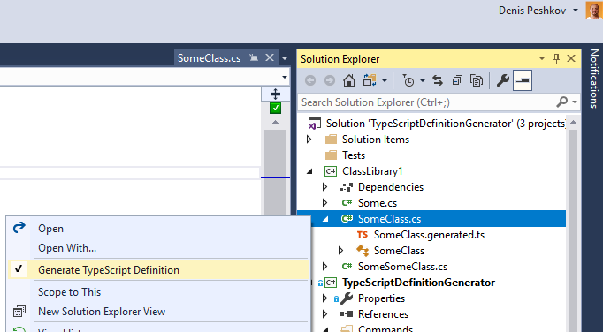
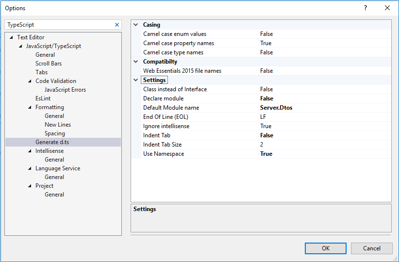

# TypeScript Definition Generator

[](https://github.com/denis-peshkov/TypeScriptDefinitionGenerator/actions/workflows/dotnet.yml)

## NOTE: This is a customed redistribute
The orginal repo wrote by @madskristensen, **best regard for him**!

Download this extension from the [Marketplace](https://marketplace.visualstudio.com/items?itemName=peshkov.5cb4e919-c9ff-4026-bd39-fd323a14fac7#overview)
or get the [CI build](http://vsixgallery.com/extension/5cb4e919-c9ff-4026-bd39-fd323a14fac7/).

---------------------------------------

Creates and synchronizes TypeScript Definition files (d.ts) from C# model classes(DTO) to build strongly typed web application where the server and client-side models are in sync. Works on all .NET project types

See the [change log](CHANGELOG.md) for changes and road map.

For Visual Studio 2015 support, install [Web Essentials 2015](https://marketplace.visualstudio.com/items?itemName=MadsKristensen.WebEssentials20153)

## From C# to .d.ts file
This extension will automatically generate .d.ts files from any C# file you specify. It will turn the following C# class into a TypeScript interface.

For *.cs file like this
```csharp
namespace foo
{
    public class ReuqestBase
    {
        public string RequestName { get; set; }
    }

    public class CustomerReuqest : ReuqestBase
    {
        public CustomerDto CustomerDto { get; set; }
    }

    /// <summary>
    /// dto for single customer
    /// </summary>
    public class CustomerDto
    {
        public int Id { get; set; }
        public string Name { get; set; }
        public IEnumerable<string> Tags { get; set; }
        //predefined type for customers
        public CustomerType CusomerType { get; set; }
    }

    public enum CustomerType
    {
        Normal = 0,
        /// <summary>
        /// Charged over $100
        /// </summary>
        Vip = 1
    }
}
```

Becomes this .d.ts file:

```typescript
declare module Server.Dtos {
	interface ReuqestBase {
		requestName: string;
	}
	interface CustomerReuqest extends ReuqestBase {
		customerDto: Server.Dtos.CustomerDto;
	}
	/** dto for single customer */
	interface CustomerDto {
		id: number;
		name: string;
		tags: string[];
		/** predefined type for customers */
		cusomerType: Server.Dtos.CustomerType;
	}
	const enum CustomerType {
		Normal = 0,
		/** Charged over $100 */
		Vip = 1,
	}
}

```

The generated .d.ts file can then be consumed from your own TypeScript files by referencing `Server.Dtos.<typeName>` interfaces.

## Generate d.ts file from C#
To generate a .d.ts file, right-click any .cs file and select **Generate TypeScript Definition**.

Then a .generated.d.ts file is created and nested under the parent C# file.




Every time the C# file is modified and saved, the content of the .d.ts file is updated to reflect the changes.

## Settings
Configure this extension from the **Tools -> Options -> Text Editor -> JavaScript/TypeScript -> Generate d.ts** dialog.



## NuGet (MSBuild + dotnet tool)

Для автогенерации .d.ts при сборке добавьте пакет:

```bash
dotnet add package TypeScriptDefinitionGenerator.MSBuild
```

Пакет подключает MSBuild targets и dotnet tool `tsdefgen`. В .csproj добавьте:

```xml
<ItemGroup>
  <TypeScriptDefinitionSource Include="Models\**\*.cs" />
</ItemGroup>
```

См. [README-RIDER.md](README-RIDER.md) для полной конфигурации.

## JetBrains Rider

Для использования в Rider см. [README-RIDER.md](README-RIDER.md) — плагин с контекстным меню, External Tool или dotnet tool для генерации .d.ts файлов.

## Сборка расширения

Расширение использует SDK-style проект (PackageReference). Сборка возможна **только на Windows** с установленной Visual Studio 2022, т.к. VSSDK требует vsct.exe для компиляции меню.

При сборке через `dotnet build` для проекта Visual Studio Extension (VSIX) требуется **.NET 8 SDK**: `global.json` в корне репозитория привязывает сборку к SDK 8.0.x (из‑за ограничений VSSDK.BuildTools на .NET 10+). Установите [.NET 8 SDK](https://dotnet.microsoft.com/download/dotnet/8.0) или собирайте расширение из Visual Studio (Build Solution).

## Contribute
Check out the [contribution guidelines](.github/CONTRIBUTING.md)
if you want to contribute to this project.

For cloning and building this project yourself, make sure
to install the
[Extensibility Tools 2015](https://visualstudiogallery.msdn.microsoft.com/ab39a092-1343-46e2-b0f1-6a3f91155aa6)
extension for Visual Studio which enables some features
used by this project.
